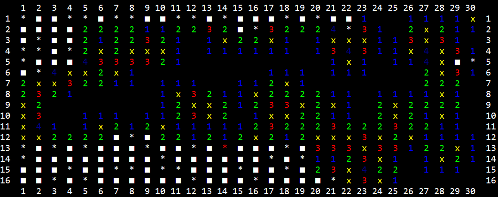

# minesweeper

## Progress
<ul>
  <li> CLI: "Prototype" - To be replaced </li>
  <li> Game: >90% </li>
  <li> Advisor: ~70% </li>
</ul>

## How To Play
<ul>
  <li> Open cmd in minesweeper.exe folder </li>
  <li> Two arguments needed - board size and manual/auto </li>
<ul>
  <li> Board </li>
  <ul>
  <li> -b (Beginner) </li>
  <li> -i (Intermediate) </li>
  <li> -e (Expert)  </li>
</ul>
  <li> Playing style </li>
    <ul>
  <li> -m (Manual) </li>
  <li> -a (Auto) </li>
</ul>
</ul>
Example:
<ul>
  <li> Manual: minesweeper.exe -b -m </li>
  <li> Auto: minesweeper.exe -i -a </li>
</ul>
</ul>

## Info

- Visual Studio 2017